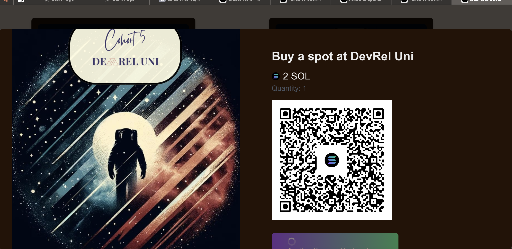

# Solana Listing & Payment Platform

- Welcome to the Solana Listing & Payment Platform! This project is built with Next.js and powered by the Solana blockchain and Solana Pay. It allows users to list items and generate payment links, complete with QR codes, enabling secure and efficient payments.

## Features

- Item Listing: Users can list any item they want to offer.
Payment Link Generation: Each listed item can have a payment link generated, making transactions seamless.

- QR Code Payment: Users can pay for items by scanning a QR code linked to their payment request, using Solana Pay for fast and low-cost transactions.

- Solana Pay Integration: Payments are processed through Solana Pay, ensuring a secure and decentralized payment experience.

- Powered by Solana: All payments are processed via the Solana blockchain, ensuring security, speed, and low transaction fees.

## Technologies Used

- Next.js: A React framework for building the UI and handling server-side rendering.

- Solana: The underlying blockchain platform for handling payments and transactions.

- Solana Pay: A decentralized payment protocol used for processing payments.

- QR Code Generation: QR codes are used for easy payment link sharing and transactions.

